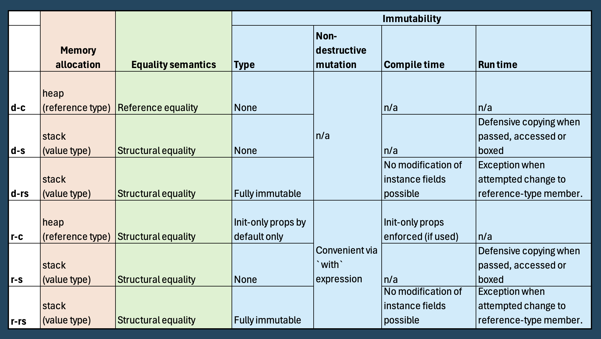

# Mixed Paradigm (OOP ⋃ FP)

- [Mixed Paradigm (OOP ⋃ FP)](#mixed-paradigm-oop--fp)
  - [Our custom FP Extensions](#our-custom-fp-extensions)
    - [Extending C# with the `Result<T>` Monad](#extending-c-with-the-resultt-monad)
    - [Monadic Composition in C#](#monadic-composition-in-c)
    - [Combinator Extensions](#combinator-extensions)
      - [Apply](#apply)
      - [Tap](#tap)
      - [Compose](#compose)
      - [Fork](#fork)
      - [Alternate](#alternate)
      - [Transduce](#transduce)
  - [Immutable Collections in C#](#immutable-collections-in-c)
    - [1. Nuanced Review of Immutability in C#](#1-nuanced-review-of-immutability-in-c)
    - [2. Avoiding Cargo Cult / CheckMade Defaults](#2-avoiding-cargo-cult--checkmade-defaults)
    - [3. Performance Implications](#3-performance-implications)
  - [Guide on Types: Class/Struct/Record](#guide-on-types-classstructrecord)
    - [The 6 Possible Permutations](#the-6-possible-permutations)
    - [Defining Features](#defining-features)

The .NET ecosystem offers the unique luxury to include C# and F# assemblies in a single solution/repository, with lower barriers for interoperability than for any other OOP/FP language pair. Here is how I'd ideally like to take full advantage of the relative strengths of both languages: 

1 - C# as the solution's main language:  
Great for UI/application development, frictionless integration with third-party libraries and other mainstream OOP tasks

2 - F# as a supplemental language (for naturally well-isolated, pure logic modules):  
Great for functional (sub-)domain modelling, elegant and resilient data transformations/algorithms...

Commercial realities may dictate sticking to C# exclusively though so F# is, in my case, probably reserved for pet projects. But even within my C# assemblies, I follow a mixed paradigm approach, following the mixed-paradigm nature of C# itself. This roughly means blending OOP principles for system organisation at the larger scale (SOLID, Dependency Injection, etc.) with a functional programming style (FP) for most of the actual code construction. 

More specifically, it means avoiding imperative code, mutability and stateful operations whenever feasible and carefully demarcating those classes that require statefulness. To reinforce this pattern I follow the convention of using `record` as my default type and `class` only when statefulness is required. 

This approach reduces side effects, and has made my code more predictable, easier to test and more suitable for concurrency and parallelism. As John Carmack argued so well in [this article](http://sevangelatos.com/john-carmack-on/), there are incremental benefits to be gained from moving towards functional style coding even within a traditional OOP language.

Luckily C# has evolved to include lots of great FP-related facilities and I draw heavily on them: Lambdas, LINQ, pattern matching, switch-expressions etc. To make up for a few still missing facilities in C#, I have created a library of light-weight FP extensions (see section below). 

This mixed-paradigm approach requires recognising where to draw the line, i.e. finding the most natural cleavage plane to resolve the inevitable tension between OOP and FP. Currently, some of the more advanced FP concepts like partial application or monadic transformation fall by the wayside in my C# code. At some point I thus even considered the use of [Language-Ext](https://github.com/louthy/language-ext) to move C# even closer to FP but distanced myself from that idea after further deliberation to ...:

a) **avoid** the extreme dependency on such a heavy-weight but only medium-popular library 

b) **avoid** further reduced readability of my C# code for most mainstream .NET devs

c) **avoid** pushing the limits of the paradigm too far, i.e. going too much against the grain of C#  

## Our custom FP Extensions

### Extending C# with the `Result<T>` Monad
  
Our `Result<T>` encapsulates the return value of an operation that might either succeed or result in an exception or a user-facing error message. It uses a discriminated union (DU) for the failure state which can either be an `Exception` or a handled `BusinessError` (with a meaningful and localised message to the user). The DU is implemented with an abstract `Failure` class. In the `Match()` clause where I handle the `onFailure` case I use a `switch expression`, where needed, to treat these two types of failures differently.  
  
### Monadic Composition in C#

Combined with .NET's `Task<T>` and `IEnumerable<T>`, custom elevated types like `Result<T>` theoretically lend themselves for elegant monadic compositions and [Railway Oriented Programming](https://fsharpforfunandprofit.com/rop/) (ROP) with the LINQ comprehension/query syntax (based on custom extensions on `Result<T>` that overload `SelectMany()`). After some initial, experimental use of ROP in the CheckMade code base, the decision was made in mid 2025 to remove this pattern and the associated extension methods again, because they pushed us too much towards unidiomatic C# code, making step-through debugging especially cumbersome.

### Combinator Extensions

I use the following combinators as part of my custom language extensions for elegant composition of functions and transformations:

#### Apply
`Apply<TIn, TOut>(this TIn @this, Func<TIn, TOut> f)` - Transforms a value by applying a function to it, enabling function application as an extension method for more readable, left-to-right function composition.

#### Tap
`Tap<T>(this T @this, Action<T> sideEffect)` - Executes a side effect on a value while returning the original value, useful for logging, debugging, or monitoring values in the middle of function pipelines.

#### Compose
`Compose<TIn, TOldOut, TNewOut>(this Func<TIn, TOldOut> @this, Func<TOldOut, TNewOut> f)` - Combines two functions by piping the output of the first into the input of the second, creating a new function that represents their composition.

#### Fork
`Fork<TIn, T1, T2, TOut>(this TIn @this, Func<TIn, T1> f1, Func<TIn, T2> f2, Func<T1, T2, TOut> joinFunc)` - Processes a single value in multiple independent ways before joining the results, enabling parallel transformation paths that converge to a final result.

#### Alternate
`Alternate<TIn, TOut>(this TIn @this, params Func<TIn, TOut>[] altFuncs)` - Tries a series of functions sequentially until one succeeds, providing fallback mechanisms when operations might fail or return `null`/`None`.

#### Transduce
`Transduce<TIn, TFilterOut, TFinalOut>(this IEnumerable<TIn> @this, Func<IEnumerable<TIn>, IEnumerable<TFilterOut>> transformer, Func<IEnumerable<TFilterOut>, TFinalOut> aggregator)` - Combines transformation and aggregation operations on collections into a single step, optimizing memory usage by avoiding the creation of intermediate collections.

## Immutable Collections in C#

In line with FP, we care about immutability of our collections...

### 1. Nuanced Review of Immutability in C#

In my mind, there are three aspects of immutability in a collection that are completely orthogonal and thus need to be treated separately. Let's explore by starting out with the seemingly obvious choice of `ImmutableList<T>` (which, it turns out, we end up hardly using)...

**Aspect-1: Immutability of Items** 

The items of our ImmutableList are not necessarily immutable themselves. If their properties can freely be mutated, would you still call the list immutable? At the least that is misleading. To ensure immutability of the items themselves, their properties' `set` access modifier should be `init` or at least `private set`. In C# a `record` created with positional properties by default use `init` and is therefore immutable (not considering non-destructive mutation via the `with` keyword). I therefore use records by default. 

**Aspect-2: Immutability of the Collection Object**

Developers can still call `.Add()` or `.Remove()` on our ImmutableList for non-destructive mutation. This protects the underlying (original) object which helps e.g. with thread safety and often is one of the main objectives.

**Aspect-3: Conceptual Immutability of the Collection**

What if the intended immutability is mainly about protecting against developers' ability to perform non-destructive mutation? That might be called for in case the collection represents some immutable concept whose integrity must be preserved throughout an application's lifetime (e.g. a fixed menu of operations). 

In this case having `ImmutableList<T>` as the underlying type is not sufficient and the API needs to, at least, expose / return it via the `IReadOnlyList<T>` interface, which doesn't offer developers mutation methods. 

Beware however, that this still offers no guarantee, because the consuming developer can simply cast back to `ImmutableList<T>`, making mutation methods available again. When a real guarantee of this kind is needed, the underlying collection would have to be wrapped in a `ReadOnlyCollection` type (can be achieved by calling `.AsReadOnly()` on the collection) - now the same attempt to cast leads to a compile-time error. 

### 2. Avoiding Cargo Cult / CheckMade Defaults

The distinctions introduced above lead to the imperative to understand where we actually need 'immutability' - and apply it at the right levels. This helps avoid premature pessimisation in terms of the involved performance penalties. 

At CheckMade, there generally is no need for using any immutability for locally scoped collections which are not passed to other modules (implementation details) and where there is no chance of multi-threaded / shared access (i.e. our default of single threaded code within a object scoped within a single function invocation).

For those collections that get passed across module boundaries (but stay within our request-scoped, thread-safe environment) our default is to guarantee immutability only from the perspective of the consumer, but maintain mutability in the producer's code - i.e. we simply wrap the collection in a `ReadOnlyCollection` (usually by calling `.AsReadOnly()` on it). A frequent use-case is faithfully representing (and operating on) events from our Event Sourcing datastore. 

Besides keeping flexibility for the producer, this also avoids (unnecessary) performance penalties (note that `ReadOnlyCollection` provides the consumer with a transparent view to the wrapped collection - as the producer mutates it, the consumer sees the updated version). This approach is sufficient to provide us with most of the desired immutability benefits in our small-team, mono-repo project. 

There may be rare cases, however, where full immutability is necessary, e.g. if any one of the following applies:
- Guaranteed snapshot semantics are needed
- It cannot be ruled out that the consumer runs on a different thread than the producer (and no synchronisation is in place)
- Performance-optimised equality comparisons are required (once computed hash codes can simply be cached)

In such cases, we must also protect against accidental mutation in the producer and thus need to utilise any of the immutable collection types (like `ImmutableList<T>`) in addition to wrapping them in `ReadOnlyCollection`. That's when the following notes on performance become relevant... 

### 3. Performance Implications

Writing to and reading from an `ImmutableList<T>` is one to two orders of magnitudes slower than `List<T>`, for large collections this can be significant. If we know that no (or hardly no) writes are needed, an `ImmutableArray<T>` offers full, mutable read performance (and even more terrible write performance). 

If we need a Set or Dictionary instead of a List and no writing is needed then `FrozenSet` and `FrozenDictionary` (from .NET 8) offer highly optimised read performance and allow achieving 'aspect-3' without the need for wrapping in `ReadOnlyCollection`. 

When batch mutating any immutable type (e.g. in a loop), simply use the `Builder` before converting back to the immutable type. 

In conclusion, we carefully choose the appropriate type/patterns/tools in the spirit of avoiding premature pessimisation. 

## Guide on Types: Class/Struct/Record

C# offers a rich selection of types and it may not always be obvious how to choose best to support our FP-oriented, mixed paradigm approach to programming. Leaving aside fairly clear cut types like `interface` and `enum`, the following guide will help us choose appropriately between `class`, `struct`, `record`, `record struct` and the use of the `readonly` modifier on structs. 

This guide is based on the underlying insight of the orthogonality between these keywords (as reflected in the following tables).

### The 6 Possible Permutations

|           | class | struct | readonly struct |
|-----------|-------|--------|-----------------|
| default   | d-c   | d-s    | d-rs            |
| record    | r-c   | r-s    | r-rs            |

### Defining Features

Notes:
- Structs go on the stack only if they are not a member of a reference type. In that case they are stored on the heap together with its home object. 
- All record types are pure compile-time constructs. They compile down to regular classes or structs plus additional synthesised convenience members (like `ToString()` for pretty printing, a deconstructor, and the methods needed for non-destructive mutation).
- Careful: counter-intuitively, `record structs` are fully mutable when not used with the `readonly` keyword. 

